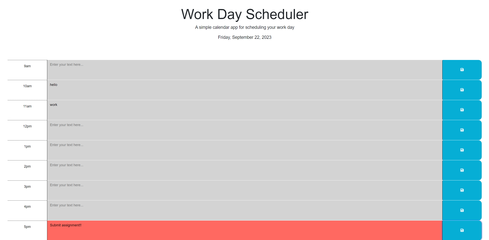

# Work Day Scheduler

This app is a work day scheduler designed to allow a user to input their events in given, color-coded time blocks to keep track of their work day. 
Events presist after page reload and time block colors indicate whether the event is in the past, present or future.

Note: the starter code for this app can be found at <https://github.com/coding-boot-camp/crispy-octo-meme>

A live demo of this app can be found at <https://huntermuratore.github.io/work-day-scheduler/>

